# Mini Office

Mini Office es una aplicación de escritorio desarrollada en Python utilizando PySide6 (Qt for Python).  
Permite crear, editar y guardar documentos de texto con formato, incorporando funciones básicas de un procesador de texto como edición, formato y búsqueda avanzada.

---

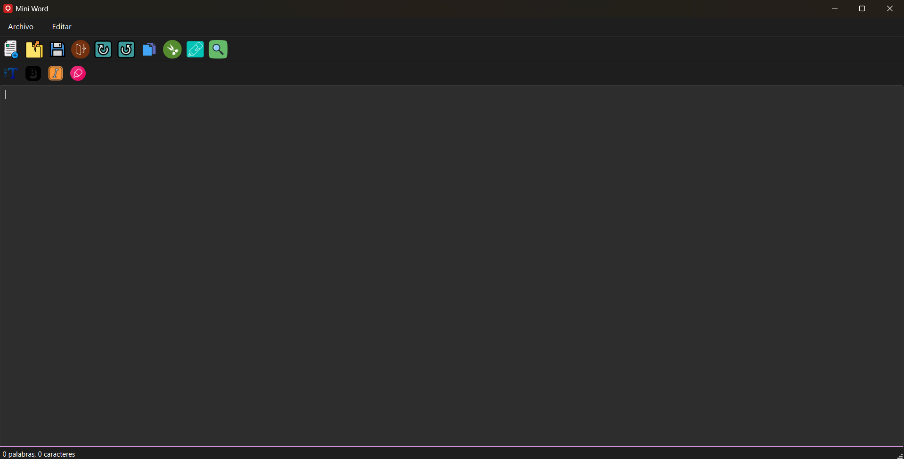

---

## Funcionalidades principales

### Gestión de archivos

- Nuevo archivo: Limpia el contenido actual para iniciar un nuevo documento.
- Abrir archivo: Permite cargar archivos de texto (.txt) o HTML (.html).
- Guardar archivo: Guarda el documento en formato texto o HTML según la extensión seleccionada.
- Salir: Cierra la aplicación de forma segura.

### Edición de texto

- Deshacer / Rehacer: Control de cambios para revertir o restaurar acciones.
- Copiar, cortar y pegar: Soporte completo del portapapeles.
- Formato de texto: Aplicación de negrita, cursiva, cambio de fuente y color de fondo del texto.

### Búsqueda y reemplazo

- Panel lateral acoplable o flotante para buscar y reemplazar texto.
- Posibilidad de buscar siguiente, anterior o todas las coincidencias.
- Resaltado de coincidencias en el documento.
- Reemplazo individual o global de términos.

### Interfaz y usabilidad

- Barra de herramientas principal con las acciones más frecuentes.
- Subbarra de formato de texto con botones para negrita, cursiva, fuente y color de fondo.
- Barra de estado que muestra en tiempo real el número de palabras y caracteres del documento.
- Atajos de teclado para todas las acciones principales.

---

## Atajos de teclado

| Acción              | Atajo            |
| ------------------- | ---------------- |
| Nuevo               | Ctrl + N         |
| Abrir               | Ctrl + A         |
| Guardar             | Ctrl + G         |
| Salir               | Ctrl + E         |
| Deshacer            | Ctrl + Z         |
| Rehacer             | Ctrl + Y         |
| Copiar              | Ctrl + C         |
| Cortar              | Ctrl + X         |
| Pegar               | Ctrl + V         |
| Buscar / Reemplazar | Ctrl + F         |
| Negrita             | Ctrl + B         |
| Cursiva             | Ctrl + I         |
| Color de fondo      | Ctrl + Shift + C |
| Tipo de letra       | Ctrl + T         |

---

## 🎤 Comandos de voz

MiniOffice incluye un sistema de **reconocimiento de voz** que permite ejecutar acciones del editor mediante comandos hablados.  
Para activarlo, selecciona **Editar → Reconocer voz** o pulse el icono del micrófono.

### 🗣️ Comandos disponibles

| Comando                              | Acción realizada                       |
| ------------------------------------ | -------------------------------------- |
| **"negrita"**                        | Activa o desactiva el texto en negrita |
| **"cursiva"**                        | Activa o desactiva la cursiva          |
| **"subrayado"**                      | Activa o desactiva el subrayado        |
| **"nuevo"** / **"nuevo documento"**  | Crea un archivo en blanco              |
| **"guardar"** /**"guardar archivo"** | Guarda el archivo actual               |

### 📝 Funcionamiento

El sistema escucha **un único comando** al activarse y ejecuta la acción correspondiente.  
Su objetivo es permitir **control por voz del editor**, no dictado continuo de texto.

---

## Tecnologías utilizadas

- Python
- PySide6

---

## Pasos para generar el ejecutador .exe

- Instalar pipx para utilizarlo como instalador en lugar de pip, así evitamos conflictos con dependencias y otros problemas.

- Agregamos pipx a las variable de entorno del sistema para poder usarlo como comando desde terminal.

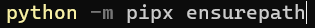

- Instalar pipenv que sirve para gestionar las dependencias y el entorno virtual que vamos a usar.

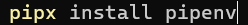

- Inicializar el entorno virtual.

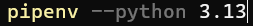

- Instalar las dependencias necesarias sobre el entorno virtual, en este caso pyside6 y pyinstaller.

- Entramos al subshell.

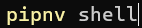

- Ahora hay que generar el .exe en un único archivo con --onefile, --noconsole para evitar ver se despliegue la consola al ejecutarlo, --name para definir el nombre del .exe, --icon para definir el icono y --add-data para agregar las imagenes y otros recursos de los que dependan el proyecto.

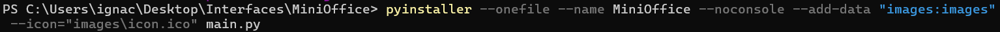

---

## Firma digital del ejecutable

- Creación del certificado y comprobación.

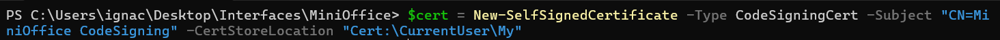  
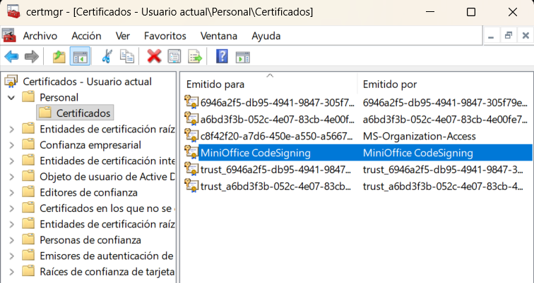

- Asignación de la contraseña al .pfx

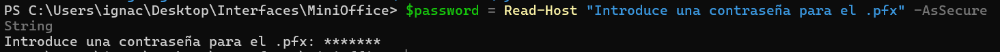

- Exportación del certificado al escritorio.

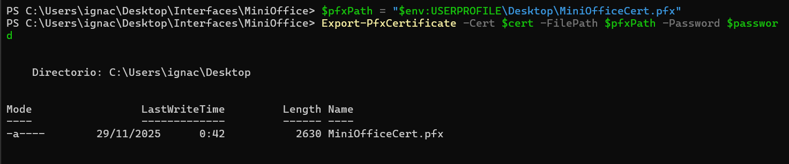

- Instalación del SDK para las firmas de windows y lo agregamos al path del sistema.

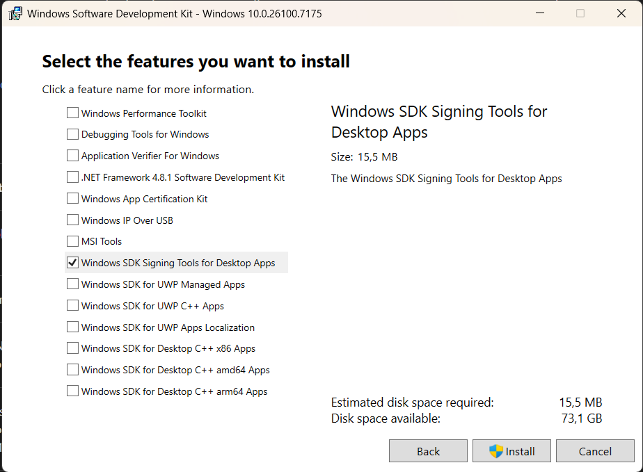  
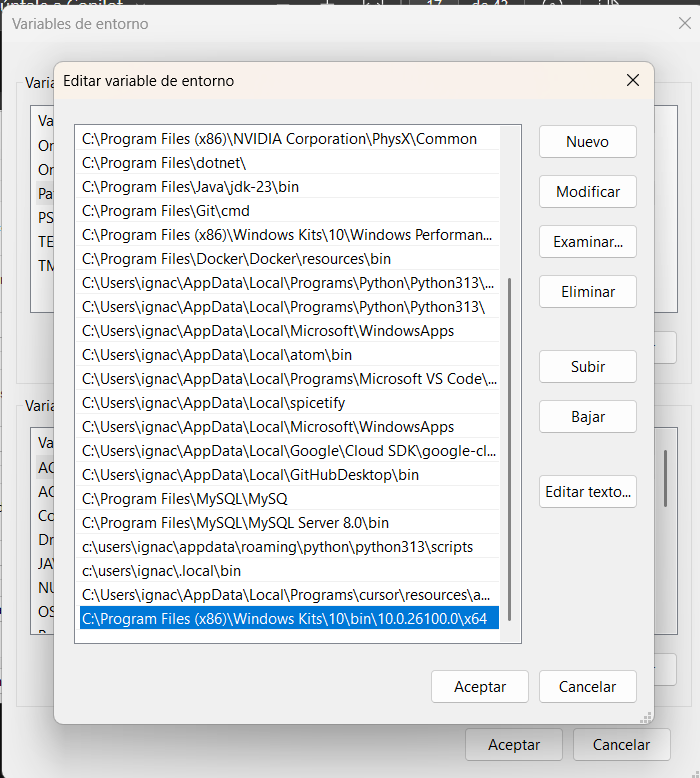

- Firma aplicada al ejecutable y verificación.

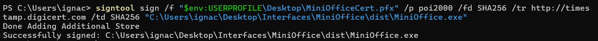
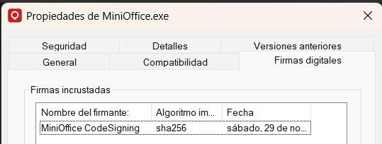

---

## Creación del instalador con Inno Setup

Para generar un instalador profesional se utilizó **Inno Setup**, configurando los parámetros.

- Instalación de Inno Setup

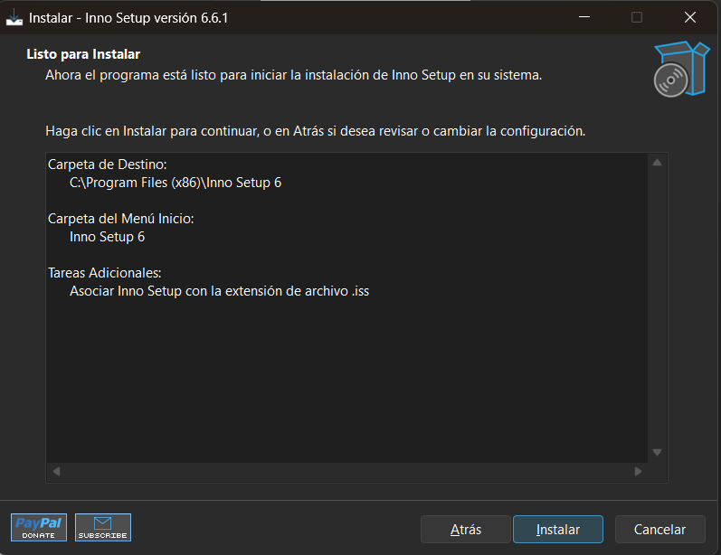

- En lugar de crear un Script en blanco, he utilizado el de Wizard.

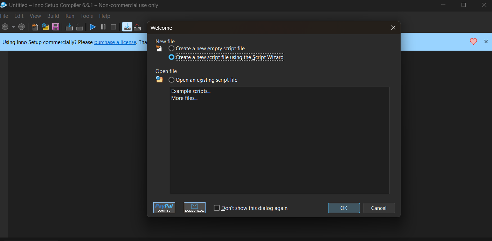

- Proceso de instalación.

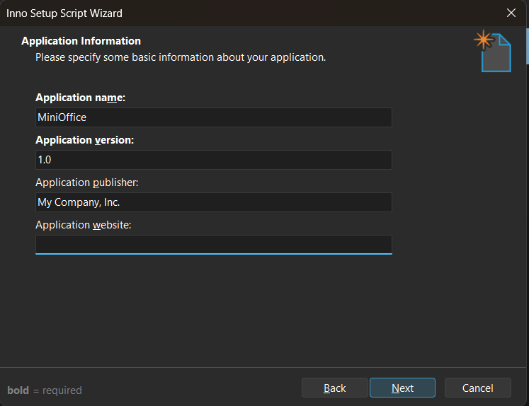
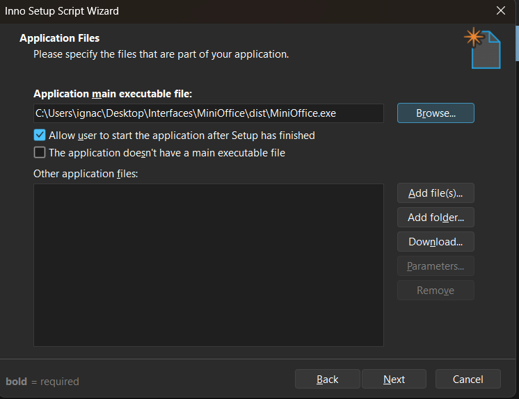
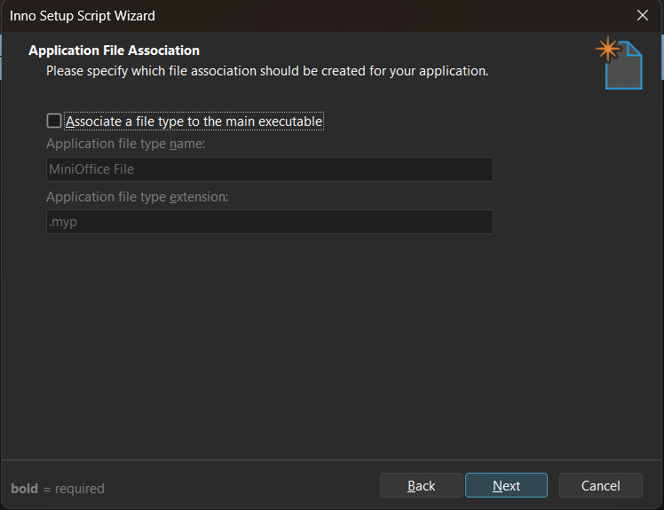
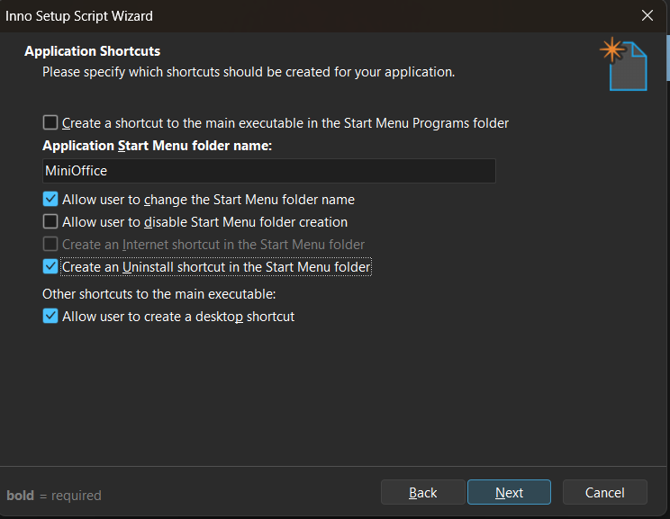
(Importante que si quieres que se genere el desinstalador marques la opción)

- Selección de licencia MIT.

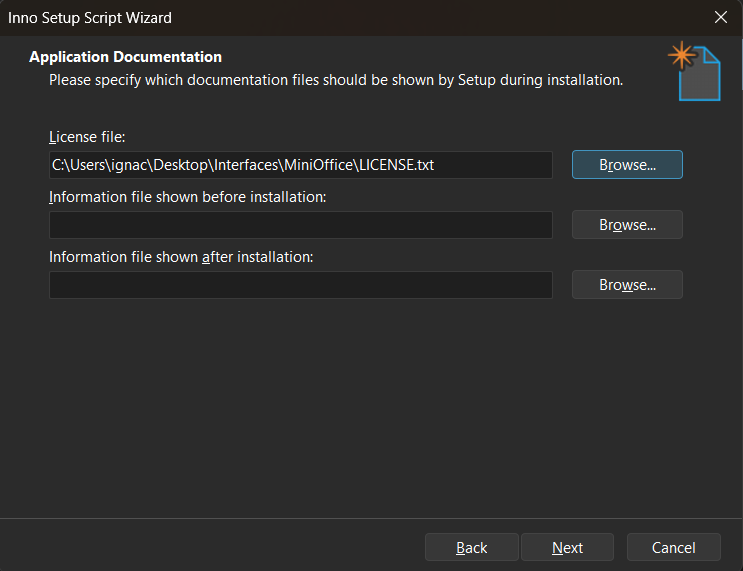

- Continuación de la instalación.

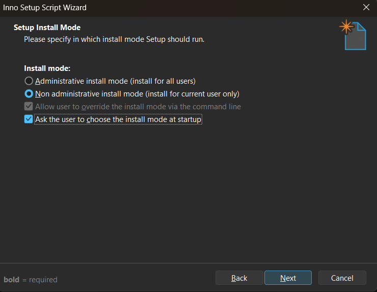

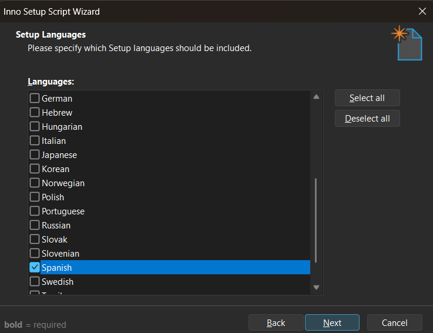

- Nombre del instalador cuando se genere y dirección del icono que tendrá.

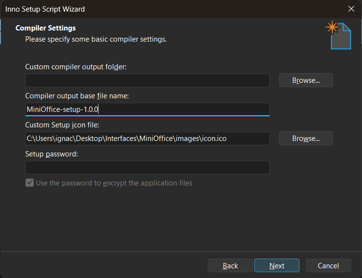

- Estilo que tendrá el instalador.

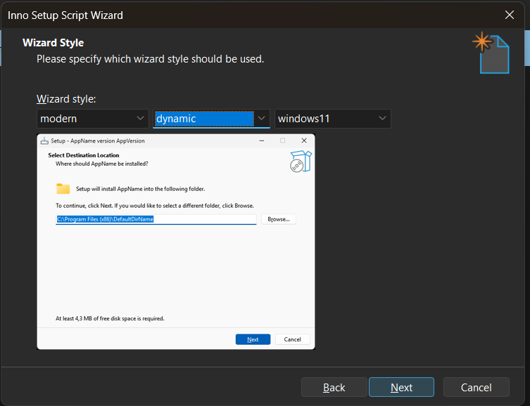

- Script del .iss una vez generado y configurado.

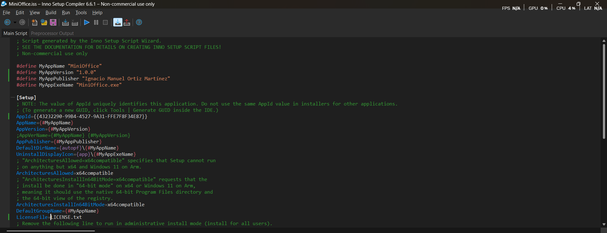

- Se han cambiado las rutas absolutas por rutas relativas y luego se ha compilado.

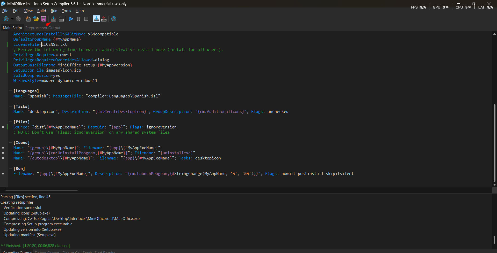

- Una vez generado el instalador, comprobar que funciona.

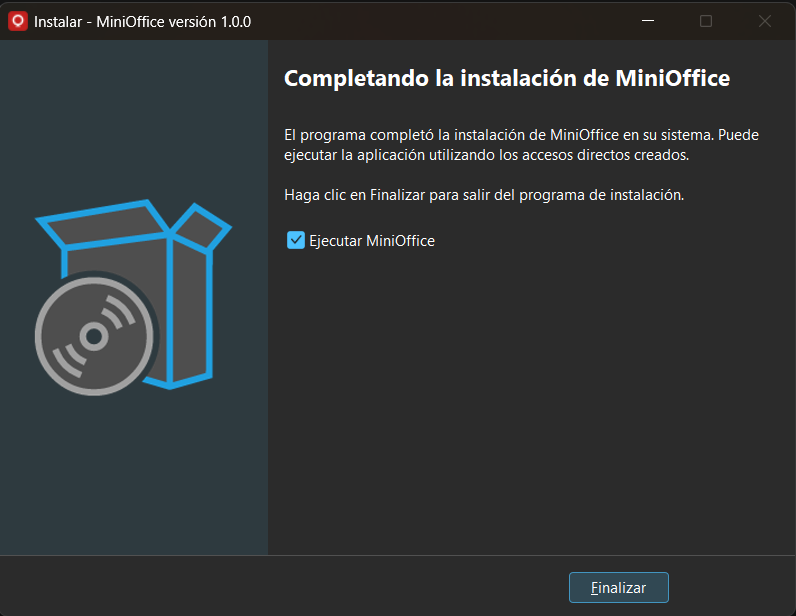
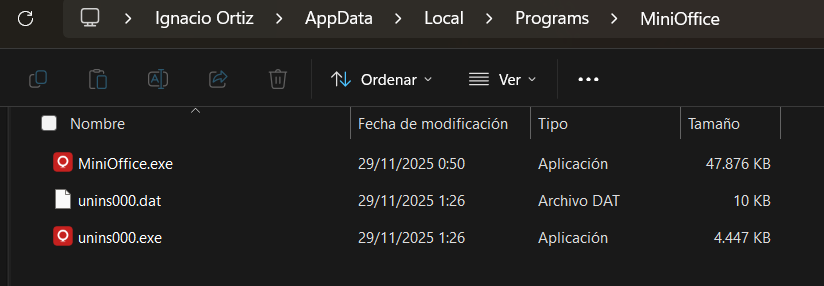
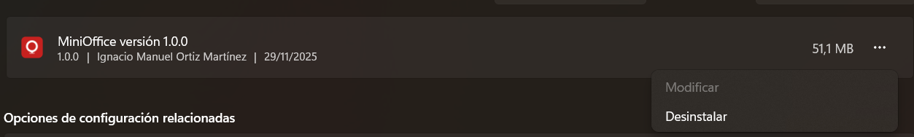

---

## Publicación del instalador y el .exe en GitHub Releases

Para no subir ejecutables al repositorio, se usa **GitHub Releases**.

- Instalación de GitHub CLI.

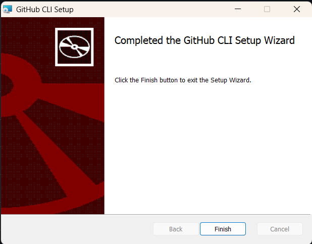

- Autenticación en cuenta de GitHub.

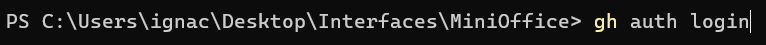

- Creación de la release desde terminal.

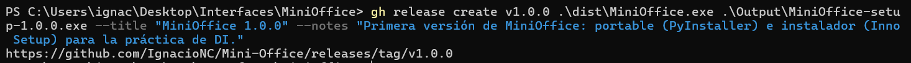

- Resultado final por terminal

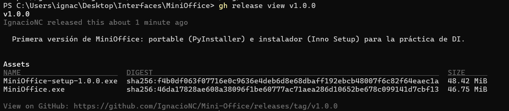

El instalador puede descargarse desde la sección **Releases** del repositorio.

---

## Autor

Ignacio Manuel 
Desarrollo de Aplicaciones Multiplataforma (DAM) 
Módulo: Desarrollo de Interfaces
